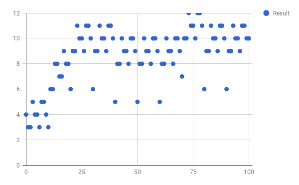
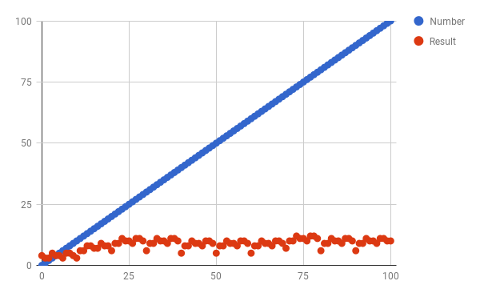

# Cosmic Four

## Prerequisites 
- Python 3  
- `pip install inflect`  
- `pip install csv`  

## Why Is 4 "Cosmic"?
Interestingly, if you perform the following procedure, you will always arrive at the number 4 (at least in the English language):
1. Begin with an arbitrary integer
2. Spell out the integer in words
3. Count the number of letters in the word-form of the number
4. Return to step (2) with the result from step (3) and continue until you reach 4

For example, beginning with the number 10:  
  - 10 spelled out is "ten,"   which has 3 letters  
  - 3  spelled out is "three," which has 5 letters  
  - 5  spelled out is "five,"  which has 4 letters  
  - 4  spelled out is "four,"  which has 4 letters  
...

If you continue repeating this process, you will always arrive at the number 4.

4 is "cosmic" because it is the only number which has the same number of letters as its numerical value.

## Proof
For all [citation needed] numbers greater than 4, the number of letters in their word-form is less than their numerical value. So each iteration gets closer and closer to the number 4.  
A number can't have a negative number of letters (nor zero letters), so this means that the process produces smaller and smaller positive integers until it eventually produces either a 1, 2, 3, or 4, all of which lead back to 4:  
 - 1 -> 3 -> 5 -> 4
 - 2 -> 3 -> 5 -> 4
 - 3 -> 5 -> 4
 - 4 -> 4 -> ...  
Other special cases:  
 - 0 -> 4
 - negative numbers -> some positive number -> ... (as shown above) -> 4

## Results
The following charts show the result of performing the above process once per number from 0 to 100 and from 0 to 10000, respectively. As you can see, as numbers grow larger, the number of letters in their spelled-out versions increases very slowly, lending more confidence to the idea that every number will eventually get back to four (as explained above).  
_(click charts below for interactive versions)_
### Numbers from 0 to 100 

### Numbers from 0 to 10000

### Letter-count vs. Numerical Value

The letter-count increases significantly every time a new decimal place is reach, since an additional "hundred", "thousand", etc. must be added to the number's word form. This increase is no more than twenty letters for every power of 10 which is reached. Thus, the letter-count increases roughly logarithmically with respect to the numerical value of the numbers, and thus is always less than its numerical value.

